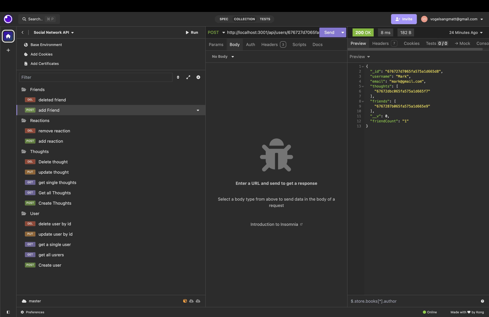

# Social Network API


## Description

This project is a robust API for a social network application that leverages a NoSQL database (MongoDB) to efficiently handle large volumes of unstructured data. Designed for scalability and performance, the API provides functionality to manage users, their thoughts, reactions to thoughts, and friend lists. Built with Mongoose and Express.js, this application ensures seamless data operations and is tested via Insomnia.

## Table of Contents

- [Installation](#installation)
- [Usage](#usage)
- [Features](#features)
- [Technologies Used](#technologies-used)
- [Testing](#testing)
- [License](#license)

## User Story

**AS A** social media startup  
**I WANT** an API for my social network that uses a NoSQL database  
**SO THAT** my website can handle large amounts of unstructured data

## Acceptance Criteria

- **GIVEN** a social network API  
  **WHEN** I enter the command to invoke the application  
  **THEN** my server is started and the Mongoose models are synced to the MongoDB database

- **WHEN** I open API GET routes in Insomnia for users and thoughts  
  **THEN** the data for each of these routes is displayed in a formatted JSON

- **WHEN** I test API POST, PUT, and DELETE routes in Insomnia  
  **THEN** I am able to successfully create, update, and delete users and thoughts in my database

- **WHEN** I test API POST and DELETE routes in Insomnia  
  **THEN** I am able to successfully create and delete reactions to thoughts and add and remove friends to a user\u2019s friend list

## Installation

1. Clone the repository to your local machine:
   ```bash
   git clone <repository-url>

2. Navigate to the project directory:
bash : cd social-network-api

3. Install the required dependencies:
bash npm install

4. Ensure MongoDB is installed and running on your local machine or provide a connection string to a hosted MongoDB database.

## Usage
1. Start the server:

bash npm start

2. Use Insomnia or a similar API testing tool to interact with the following routes:

Users: Manage users with endpoints to create, update, delete, and fetch users.

Thoughts: Manage user thoughts with endpoints to create, update, delete, and fetch thoughts.

Reactions: Add or remove reactions to thoughts.

Friends: Add or remove friends to a user\u2019s friend list.

## Features

User Management:

Create, read, update, and delete user profiles.
Add and remove friends to a user\u2019s friend list.
Thoughts and Reactions:

Create, read, update, and delete thoughts.
Add and delete reactions to thoughts.
Scalable Database:

Uses MongoDB with Mongoose for managing data efficiently.
Optimized for handling unstructured data.

## Technologies Used
Node.js: Backend runtime environment.

Express.js: Framework for building RESTful APIs.

MongoDB: NoSQL database for unstructured data.

Mongoose: Object Data Modeling (ODM) library for MongoDB.

Insomnia: API testing and debugging tool.

## Testing

Use Insomnia to test the API endpoints.
Verify:
User creation, retrieval, updating, and deletion.

Thought creation, retrieval, updating, and deletion.

Adding and removing reactions to thoughts.

Adding and removing friends from a user\ friend list.

License
This project is licensed under the MIT License. See the LICENSE file for details.


